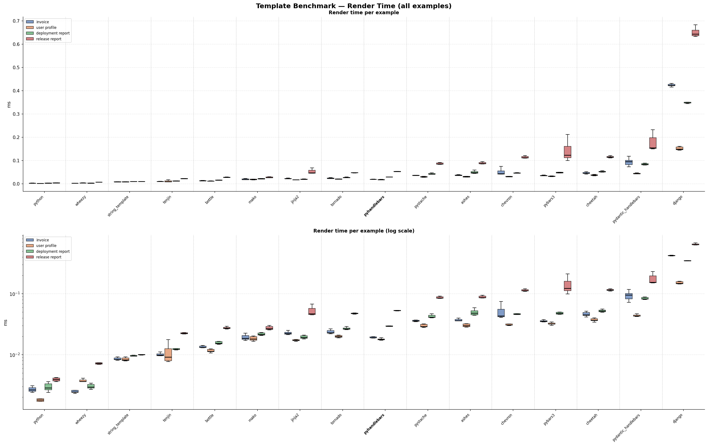
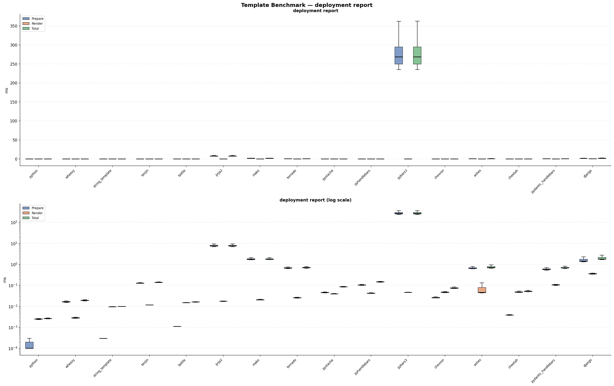
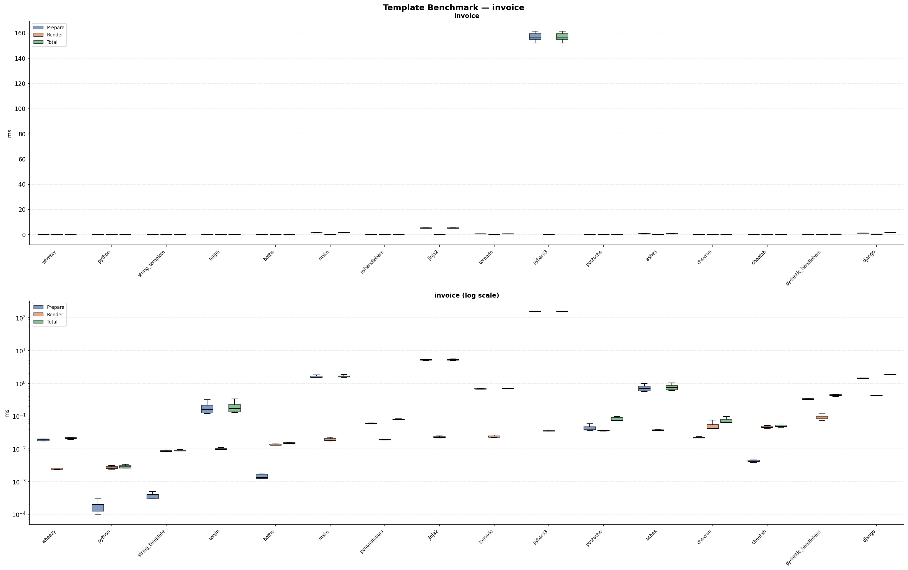
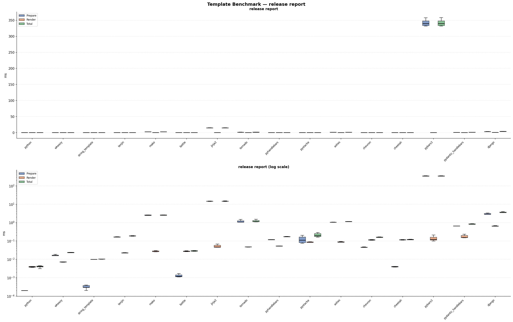
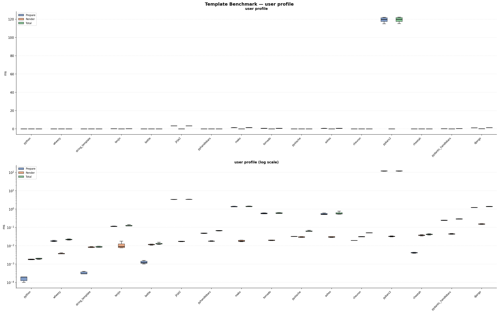

# python-templating-benchmarks
A repository to test different templating engines in Python. 
(Disclaimer: I am the maintainer of the pyhandlebars package.)

## Comparison to other Template Engines in Python
We benchmarked PyHandlebars against 13 other Python template engines across 4 examples, running 1,000 iterations each. Each benchmark measures two phases:

- **Prepare** — compiling / registering the template (done once per request cycle in a real app)
- **Render** — filling data into the compiled template (the hot path)

### Examples

| Example | What it tests |
|---|---|
| **Invoice** | Simple variable substitution and list iteration over line items with a nested address |
| **User profile** | A boolean conditional (verified badge) combined with iteration over social links |
| **Deployment report** | Nested object access and dictionary lookups — status labels and region info keyed by name |
| **Release report** | Deep nesting — components each containing a test suite and a dependency list, plus environment conditionals |

### Results

Each box shows the render-time distribution across 1,000 runs. Tools are sorted fastest → slowest by average render time. The top chart uses a linear scale; the bottom uses a log scale to make differences between fast engines visible. Here is the general summary plot:

#### Deployment Report

#### Invoice

#### Release report

#### User Profile
